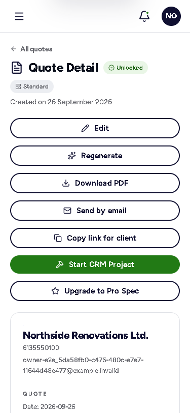
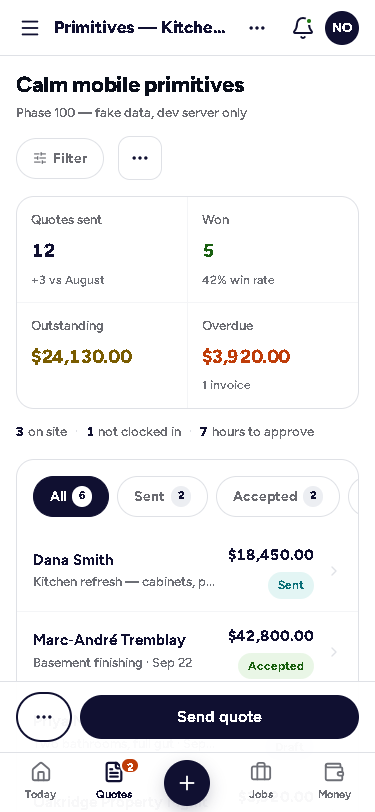

# Calm mobile — the rules

Written in Phase 100 (docs/MOBILE-AND-APP-PLAN.md), applied in every phase after it, checked by machine where a machine can see it (`qa:visual` phone rules — the gate since Phase 113: a break fails the sweep). One idea behind all ten: **open a screen, see the thing, do the one obvious action.**

The pictures are the first phone screen (375 × 812) — "before" from the 2026-09-26 audit (`.qa/visual-mobile-audit`), "after" from the primitives' preview page (`/dashboard/__preview`, dev server only).

| Don't — quote detail, 2026-09-26 | Do — the same pieces, calm |
|---|---|
|  |  |

---

## The ten rules

1. **Content first.** The first phone screen shows the thing the page is about (the quote, the job, the list), not the controls around it.
2. **One primary action per screen**, in a sticky bottom bar within thumb reach (`StickyActionBar`). Everything else goes in the **⋯ action sheet** (`ActionSheet`). Never more than two full-width buttons stacked anywhere.
3. **Numbers as a strip, not a tower.** `StatStrip`: one card, 2 columns on a phone, or a single summary line (`variant="line"`). A card that holds one number is never full-width.
4. **Lists, not tables.** Under 640 px every table becomes rows (`ResponsiveTable` → `ListRow`): a strong line (client / title), a quiet line (date · status), the amount on the right. No sideways scrolling for data.
5. **Tabs scroll, they don't wrap.** One line (`ScrollTabs`), sticky under the header when the page is long; long option sets become a menu screen (Settings, Phase 102).
6. **Progressive disclosure.** Options, filters and rarely-used fields sit behind "Options" / "Filter" and open as a `BottomSheet`.
7. **One accent at a time.** Navy for structure, one colour for status; no full-bleed colour blocks side by side on a phone.
8. **Space is the design.** 16 px gutters (`--gutter-phone`), 12 px between cards (`--gap-card`), 44 px targets (`--tap`), one type scale: title 22 / section 17 / body 15 / meta 13 (`--fs-title`, `--fs-section`, `--fs-body`, `--fs-meta`).
9. **The phone knows it's a phone.** Safe areas (`--safe-top/right/bottom/left`, `viewport-fit=cover`), `inputmode` / `autocomplete` on every field, camera and microphone one tap away, the numeric keypad for money. Nothing needs a hover or a drag: a board you drag cards across also gives each card a "Move to" menu (leads, Phase 107). A swipe is a shortcut, never the only way: a swiped row keeps its button (hours to approve, Phase 108).
10. **Same code, same words.** No separate mobile code path: the same components laid out by breakpoint, so the Capacitor app (docs/APP-PLAN.md) inherits all of it.

## The pieces (`artifacts/quote-ai/src/components/mobile/`)

| Component | Desktop | Phone (≤ 640 px unless noted) | Rule |
|---|---|---|---|
| `MobilePageHeader` + `useMobileHeader()` | hidden (sidebar + page heading say where you are) | top bar: ‹ back to the parent, the screen's title, its ⋯ | 1, 2 |
| `BottomTabBar` | hidden | ≤ 980 px: 4-5 sections + optional centred **New**; marks `<html class="has-tabbar">` so pages leave room; `match` for extra paths, `onTabClick` to take over navigation | — |
| `ActionSheet` | dropdown menu | bottom sheet of 52 px rows + Cancel | 2 |
| `BottomSheet` | centred modal | docked sheet with grab handle, safe-area padding | 6 |
| `StickyActionBar` | right-aligned row in place | docked above the tab bar / home indicator, with a spacer; primary marked `data-primary-action` | 2 |
| `ListRow`, `ResponsiveTable` | `.tbl` table (≥ 640 px) | `<ul>` of rows, one column definition (`mobile: "lead" / "title" / "meta" / "amount" / "end" / "hidden"`); `rowActions` gives each phone row its own ⋯ for what the desktop row did with its buttons, `rowClassName` dims (`dim`) or bolds (`total`) a row (Phase 110) | 4 |
| `StatStrip` | one card, N cells | 2-column grid; or `variant="line"` | 3 |
| `ScrollTabs` | one row of pills | one scrolling row, active kept in view; `sticky` pins it; runs to the screen edges (`data-bleed`, skipped by the gutter check) | 5 |
| `RowMore` | hidden (the row keeps its hover icons — pair them with `hide-phone`) | one ⋯ at the end of a row opening its actions as a sheet (Phase 106) | 2 |
| `PhoneListBar` | not used (the list keeps its pill row) | a list's head: search that stays at the top, the filter as a sheet with counts, the active filter as a removable chip (Phase 107; the quotes list's, shared) | 5, 6 |
| `SwipeRow` | an ordinary row (a mouse never drags it) | swipe right to run the row's one safe action (approve); touch / pen only, vertical scroll untouched, comes back if the action fails. **Always paired with a visible button** (rule 9) (Phase 108) | 9 |

CSS: the "CALM MOBILE (Phase 100)" section at the end of `mockup-system.css`. Tokens in `:root`.

**The dashboard's navigation at ≤ 980 px (Phase 101, `components/layout/phone-nav.tsx`)** — there is no sidebar and no drawer:

- **Tabs**: Today + the first three of the role's list that the plan shows, + More. Owner / admin / office / viewer: Quotes · Jobs · Money (invoices, pay, books, compliance) — a Starter plan without jobs and invoices gets Clients · Leads. Foreman: Jobs · Schedule · Crew.
- **More** (sheet): the account, notifications (its count is on the More tab), the company switcher when there is more than one, then every other section under Work / Money / Team / Business with the same Pro badge as the sidebar, then sign out. More is highlighted while you are on a section that has no tab.
- **+** (top bar): New quote, New lead (`/dashboard/leads?new=1`), New job (`/dashboard/jobs?new=1`), New invoice (`/dashboard/invoices?new=1`, Phase 107), Photo of a receipt (pick a job → camera → the receipt waits on the job's costs), Job note (pick a job → the Dictate sheet). Only what the role may do; no + when that is nothing.
- **Memory**: each tab reopens the last screen you had in it (path + query, session storage) at the scroll position you left; tapping the tab you are in goes to its first screen, then to the top. Every move is a history push, so Back retraces your steps; an open sheet closes when the screen changes.
- On a phone (≤ 640 px) the bell and the avatar leave the top bar (they are in More); between 641 and 980 px the top bar keeps the search, the bell and the avatar.

**Long option sets: the settings pattern (Phase 102, `pages/dashboard/settings/`)** — rule 5's "menu screen". Under 860 px the grouped list is the first screen and each section opens as its own page with ‹ back; wider, the list sits on the left and the section on the right. Sections are built from `SettingsSection` / `SettingsGroup` / `SettingsRow` (label and help left, field right; stacked ≤ 640 px) / `ToggleRow` (the whole row is the switch) / `ActionRow` in `settings/ui.tsx`. Nothing saves on change: a section keeps one `useSettingsDraft` and the page shows one sticky **Unsaved changes — Discard / Save** bar (docked above the tab bar on a phone), with a "Leave without saving?" prompt on in-app links.

**Using them**

- A screen's primary action: `<StickyActionBar><ActionSheet actions={…} /><button className="btn btn-navy" data-primary-action>Send</button></StickyActionBar>`.
- A detail page names itself in the phone top bar: `useMobileHeader(useMemo(() => ({ title: quote.title, actions }), [quote.title, actions]))` — memoise, every change re-renders the bar.
- Tables: write the columns once and say where each lands on a phone; anything unmarked is hidden there — choose, don't inherit a desktop.
- **A board becomes an agenda (Phase 109, the schedule).** A grid a mouse drags on (people × days, a time axis) does not shrink to a phone: under 768 px show a strip to jump (seven days with a dot per item, red for a problem) and the chosen day as `ListRow`s grouped by what the reader asks (by person / by job, a two-way switch), with the one action (Add) docked and every change made in the item's sheet. Pages that pick a whole layout by width use `useMediaQueryNow` (`hooks/use-media-query.ts`), which answers on the first render, so the wrong layout never fetches or flashes.
- **A table with buttons on each row (Phase 110, the long tail).** Write the columns once with `ResponsiveTable`, mark the button column `hidden` and hand the same actions to `rowActions` — or, where a desktop cell holds more than a phone line can, render `ListRow`s in a `phone ?` branch with the row in an `li.lrow-split` next to a `RowMore`. A tab row is `ScrollTabs` (it takes the pill icons), a stat grid is `StatStrip`, a long settings form docks its Save in a `StickyActionBar`, a page's header buttons become the docked primary plus a ⋯ (the catalog).
- Small utilities (Phases 105-106): `.hide-phone` / `.show-phone` (≤ 640 px / above it); an `.item-row.wrap-phone` puts its `.row-acts` on a second line on a phone instead of squeezing the text; hover-only icons (`.hover-act`) are always visible on touch screens (`@media (hover: none)`), so on a phone put them in a `RowMore`.

## What the machine checks (`qa:visual`, ≤ 640 px)

Reported under "Phone rules" in `.qa/<out>/report.md` and as `phone:<rules>` on the console line. **Since Phase 113 they are errors**: `qa:visual` exits 1 on any of them (and on any overflow, gutter, serious/critical axe node, blocking screen-reader finding, raw key or error page); `--gate=false` reports without failing, for a baseline before a change. The report also lists every phone page's height against its budget, tallest first.

| Rule id | Fires when |
|---|---|
| `stacked-buttons` | more than two buttons ≥ 70 % of the width in one column (rows are not counted: a switch row, a section header that opens and closes, a button that is a list row) |
| `full-width-stat` | a `.stat-card` ≥ 80 % of the width (not `.stat-card.editable`, which holds a field) |
| `wide-table` | a `<table>` wider than its box |
| `wrapping-tabs` | a `.pills` / `.stabs` / `[role=tablist]` / `.seg` row on more than one line (not `.pills.choices`: a set of chips to pick from is meant to wrap, Phase 111) |
| `tall-page` | taller than its budget: 6 phone screens for an app page, 10 for a public page, or the page's own entry in `PHONE_BUDGETS` (`src/e2e/visual-a11y.ts`) — each with the reason it is long and its height when set (Phase 113) |
| `primary-offscreen` | the `[data-primary-action]` is below screen one and not in a docked bar |
| `under-tabbar` | with a tab bar showing, the end of the page is hidden under it |

## The phone sheets

```bash
pnpm --filter @workspace/api-server qa:visual -- --lang=en --widths=375 --axe=false --sr=false --out=p1xx --routes=quotes
pnpm --filter @workspace/api-server qa:phone-sheets -- --from=p1xx --baseline=visual-mobile-audit
```

Each route's first three phone screens side by side (before over after with `--baseline`), plus an `index.html` to flick through on a phone, in `artifacts/api-server/.qa/phone-sheets/<from>/`. Every Track A phase attaches its sheets to the build log.

**The whole app in one review page (Phase 113):** `qa:phone-sheets -- --from=<run> --lang=en,fr --format=jpg --scale=0.7` puts EN over FR on one sheet per route and lists them tallest first — the page to hold on a real phone after a sweep.

**Height budgets.** A new page starts at the default (6 screens in the app, 10 on the public site). If it needs more, it gets its own `PHONE_BUDGETS` entry with the reason and the height the day it was set. Adding an entry is not the fix for a page that grew: fold something first (a section behind a toggle, rows instead of cards, a sheet instead of an open form). The report's "Phone heights" table shows how much room each page has left.

## What the phases learned (100-113)

- **Most of the mess was order, not size.** The same pieces, rearranged so the content comes before the controls, did more than any redesign: the quote first and one docked primary (105), the job's tabs on screen one (106), Clock in on screen one (108).
- **Every ⋯ needs a home on a computer too.** `ActionSheet` is a dropdown wide and a sheet narrow, so a menu written once works everywhere; never build a phone-only menu.
- **French is the width test.** French strings are about 20 % longer: the catalog's header bar at 768 px (110) and the assistant's starter questions (113) broke only in French. Sweep both languages before calling a phone layout done.
- **Data length is not layout length.** A 30-line quote is a long page however well it is laid out; budget those pages by what they hold (`PHONE_BUDGETS`), and keep the default for everything else.
- **Label-in-name.** Don't `aria-label` a row or a strip button with text different from what it shows; put extra words in an `sr-only` span after the visible text (105, 109).
- **Things that widen a phone page by accident:** `sr-only` (absolute) text inside a sideways scroller that isn't `position: relative` (112); a sheet's inline grid style beating a media query (107). The overflow check catches both; the fix is in the scroller, not the text.
- **Hover and drag are desktop-only.** Hover icons show on touch screens (`@media (hover: none)`), boards get a "Move to" menu, swipes are shortcuts paired with a button.
- **Fields on a phone are 16 px**, or iOS zooms the page (111); give every field its keyboard and autofill.
- **The sweep's full-page screenshot puts fixed things mid-page** (the top bar, docked bars, sheets): to judge a sheet, look at the first 812 px only.

**The crew app (`/t/:token`, Phase 108)** — a public page with no tab bar, so the docked bar sits on the home indicator:

- Screen one is **Now**: the shift, the job, address → Maps, site contact, the shift notes, and Clock in / out as the big button (`.w-big`, 56 px). Nothing above it but the header (name, company switch, the changes chip, FR / EN).
- Docked: ⋯ (hours by hand, travel) · Photo (secondary) · Report (primary). Forms are sheets, never always-open cards.
- Sheets on a public page need their strings in the core dictionary (`translations.ts`), the dialog's Close label included.

**What clients see (Phase 111: `/p`, `/sign`, `/i`, `/portal`)** — opened from an email on a phone, often the only screens a contractor's customer ever sees:

- The document is the page, under the `doc-head` (who it is from, what it is). A status the client needs (accepted, paid, declined) is the first thing on the page, not a banner after the document.
- One docked primary — **Accept** with the total beside it, **Review & sign / Sign**, **Pay by card · amount** or **I've sent it** — and a step that asks for something (the name, the emailed code, the signature, a reason to decline, "I've sent it") opens as a `BottomSheet` over the document instead of a form appended after it. A page like this puts `.doc-docked` on its shell: the room at the end is the page's padding (the bar's in-flow spacer would land mid-page).
- A long document keeps its bar pinned on a computer too (`.sign-page`): reading thirty screens of contract to find the button is the same problem at 1280.
- Codes use `.otp-input` (`inputMode="numeric"`, `autoComplete="one-time-code"`, `pattern="[0-9]*"`); a signature pad is as wide as its sheet and 200 px tall on a phone, with 40 px mode and clear buttons.
- **Every field is 16 px on a phone** (a global rule in the Phase 111 CSS; `.otp-input` / `.code-input` are larger on purpose): iOS zooms the page into any smaller field. `html` has a `scroll-padding-bottom` the height of a docked bar, so a focused field scrolls into view above it. Give every field its keyboard and autofill: `type="email"` + `autoComplete="email"` + `autoCapitalize="none"`, `type="tel"`, `autoComplete="name" / "organization" / "street-address"`, and `enterKeyHint` (next / go / done / send).
- Choices shown as chips (`.pills.choices`, onboarding's trades) wrap on purpose; tabs never do.

**The public site (Phase 112: home, pricing, footer, chat)**

- A marketing page keeps its desktop length if it reads well there; the phone gets a subset of the **same components**, hidden with `hide-phone` / shown with `show-phone`, never a second page. Hidden content stays in the prerendered HTML.
- Colour slabs become rows on a phone (a title and one short line, `.tile-short`); a comparison table becomes one feature per row with each column's answer under it (`.cmp-list`); side-by-side plans become a swipe row opened on the recommended one (`.price-grid` ≤ 720 px, the scroller `position: relative` so absolute `sr-only` text can't widen the page).
- Questions are a folded list (`components/faq-list.tsx`), not answer cards.
- Nothing floats over a public page on a phone: the support chat opens from the "Questions? Chat with us" line above the footer (`openSupportChat()`).
- A link on the phone drawer or footer never points at a section a phone hides.
